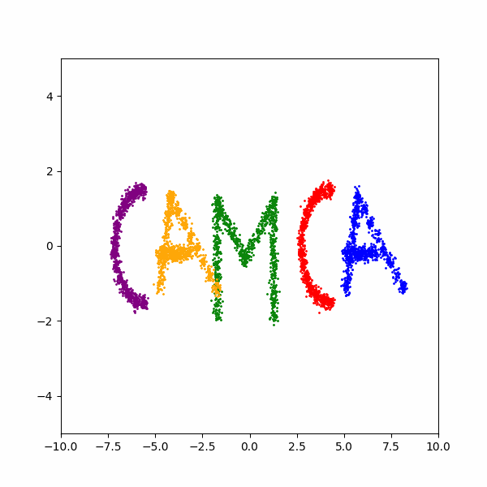

# IEEE NSS/MIC 2024, Short-course ' Hand-on Diffusion Model' 
This Repository contains examples of Score-Based Diffusion Model Demo for MIC

The codes were originally written by Mattew Tivnan (CAMCA, Instructor at Massachusetts General Hospital and Harvard Medical School)


Presented by Siyeop Yoon (CAMCA, Post-doc at Massachusetts General Hospital and Harvard Medical School, syoon5@mgh.harvard.edu)


<p>
    <br>
     
    <br>
</p>


# Diffusion Laboratory Environment Setup

This guide provides the steps to set up the `my_diffusion_laboratory` Conda environment, install required packages, and clone the `NSS_MIC_2024-DiffusionCourse` repository. This environment will support diffusion model experimentation using PyTorch with CUDA acceleration.

if you are already familiar to deep-learning development using torch, please jump to step 5.

## Environment Setup Instructions

Ensure that you have [Conda](https://docs.conda.io/projects/conda/en/latest/user-guide/install/) installed. An NVIDIA GPU with compatible drivers is recommended for CUDA support.


### 1. Create and Activate the Conda Environment

First, create a new Conda environment named `my_diffusion_laboratory` and activate it:
```bash
conda create --name my_diffusion_laboratory
conda activate my_diffusion_laboratory
```

### 2. Install Python and FFmpeg

Within the environment, install Python 3.12 and FFmpeg:

```bash
conda install python=3.12 pip ffmpeg
```

### 3. (optional)Install CUDA Toolkit (CUDA 12.4.1)

Install the CUDA 12.4.1 toolkit from NVIDIA’s Conda channel for GPU acceleration:

```bash
conda install -c nvidia/label/cuda-12.4.1 cuda-toolkit
```


### 4. Install Python Packages

Using pip, install essential Python packages, including numpy, matplotlib, and torch with CUDA 12.4 compatibility:

```bash
pip install numpy matplotlib
pip install torch torchvision
```


### 5. Clone the Diffusion Course Repository

Clone the NSS_MIC_2024-DiffusionCourse repository, which contains diffusion model resources:

```bash
git clone https://github.com/siyeopyoon/NSS_MIC_2024-DiffusionCourse
```

